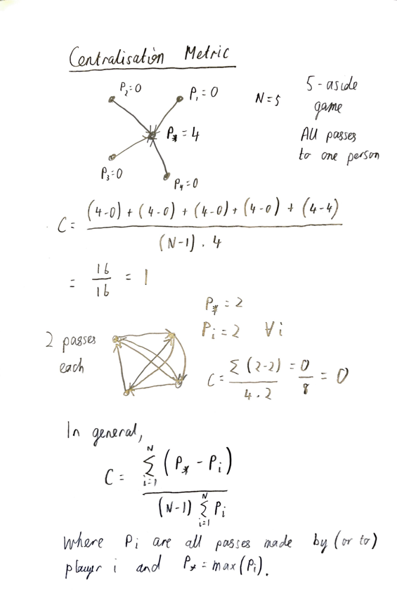
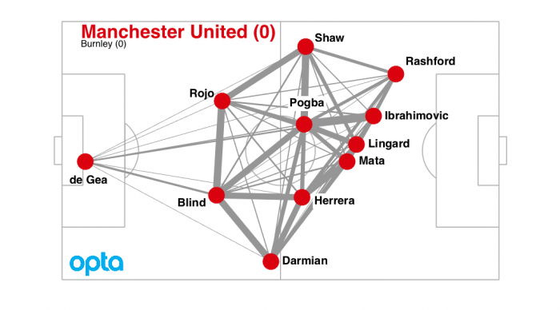
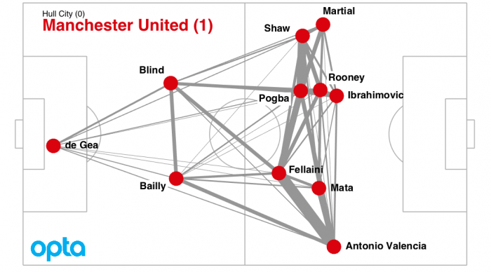
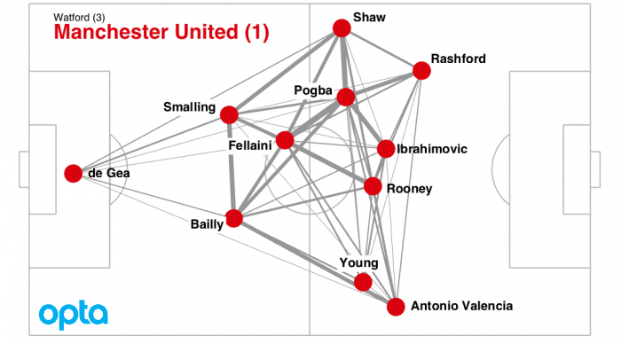

Case study: decentralised football 
==================================

### Measuring centralisation

In mathematics, we call a passing network a weighted graph. The players 
are nodes and the passes create the edges of the graph. 
The number of passes (which gives the thickness of the lines in 
the passing network) to player $i$ from player $j$ are called the weights, 
and denoted $w_{ij}$. The strength centrality index presented by 
Grund (2012)is defined as

$$ C = \frac{\sum^N_{i=1} (P_* - P_i)}{(N-1) \sum^N_{i=1} P_i} $$

where $P_i = \sum^N_{j=1} w_{ij}$ are all the passes to player $i$ and
$P_*= \max(P_i)$ is the passes to the player passed to most.

Below is example of using centralisation during the 2016-17 season to look at Paul Pogba.
It nicely illustrates how we can first use passing networks to get an overall 
idea of how a team is playing, then we calculate a statistic – 
the centrality, $C$, in order to compare teams over a longer time period.

### Example networks

Anyone questioning the importance of Paul Pogba in this season’s Manchester United side should look at the figure below.

This is the passing network for Manchester United’s draw against Burnley. The players are the red dots, placed according to the average position they received and passed the ball. The grey lines connecting them indicate the number of successful passes pairs of players made. The thicker the line, the more passes were made. The most common pass was between Pogba and Zlatan Ibrahimovic with 28 passes in total: Pogba passed Zlatan 16 times and Zlatan passed Pogba 12 times.
The dominance of Pogba wasn’t unique to that match. Here is United’s passing network when they defeated Hull City. Again, Pogba is the player involved in most passing combinations.

And another network from when United lost away to Watford.

While the team didn’t make the breakthrough, Pogba was central to their attack. There are typically between 800 and 1100 passes made during a Premier League football match. Passing networks like the ones above give us a simple way of visualising how a team is playing. We can see directly the central role that Pogba has in the Manchester United team.
Below is a passing map for Arsenal against Watford.

There are two differences between United and Arsenal’s style of play that we can see from this network. Firstly, Arsenal play more centrally. Their wingers aren’t as far out as United’s, and their attacking midfielders play in front of the box. Secondly, against Watford Arsenal were less centralised. The passing was well distributed through the whole team.
And here are Liverpool in their emphatic victory over the same oppositon.

Like Arsenal, Liverpool played the highly decentralised style of football. The whole team was involved in passing to an almost equal degree.
A study Premier League between 2006 and 2008 by mathematical sociologist, Thomas Grund, showed that teams that have centralised passing networks, connecting players unequally, are typically less successful than those with decentralised passing networks. In the Geek Box below I explain the centrality measure that Grund proposes.
Arsenal and Liverpool won easily against Watford, while United lost. But, as we have learnt earlier in this series of articles, we shouldn’t place too much importance on score lines from individual matches.
Instead, the centrality measure reveals a potential weakness in Manchester United: they focus too much on Paul Pogba. He was involved in 98 passing combinations in the match against Watford. Taken together, Antony Martial and Ashley Young, who replaced Martial after 38 minutes, were involved in only 45 passes. There are big expectations on the world’s most expensive player, and it appears that his manager and teammates share these expectations. In many of United’s matches, especially against teams lower in the league table, he has been the focus of their attacking play.
Passing networks and centralisation measures give us an understanding of tactics. Studies have shown that over reliance on one, or a small number of players, in a team leads, on average, to worse results for a team. On this measure Liverpool and Manchester City (see Geek Box) look to be in better shape than Manchester United, both in terms of results so far this season and in terms of their decentralised style of play.

### Centralisation measurements

Of the first 11 matches in this season’s Premier League, 
Manchester United have an average centralisation score of $C=14.5$%.
Liverpool and Manchester City have centralisation scores of $C=10.1$% 
and $C=10.3$%, respectively.
Although Arsenal played in a 
decentralised way against Watford ($C=10.0$%), they 
have played in a much more centralised way in other matches, 
especially against Liverpool and Chelsea. 
On average Arsenal’s centralisation score is $C=14.6$%.

### Further reading

[Grund, Thomas U. “Network structure and team performance: 
The case of English Premier League soccer teams.” 
Social Networks 34.4 (2012): 682–690.](https://www.sciencedirect.com/science/article/pii/S0378873312000500)
