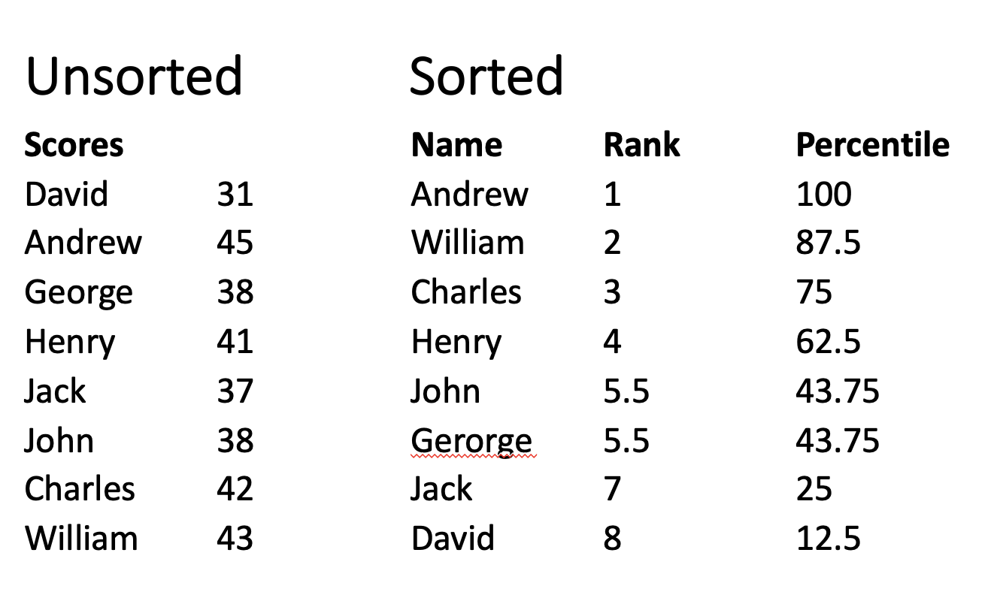
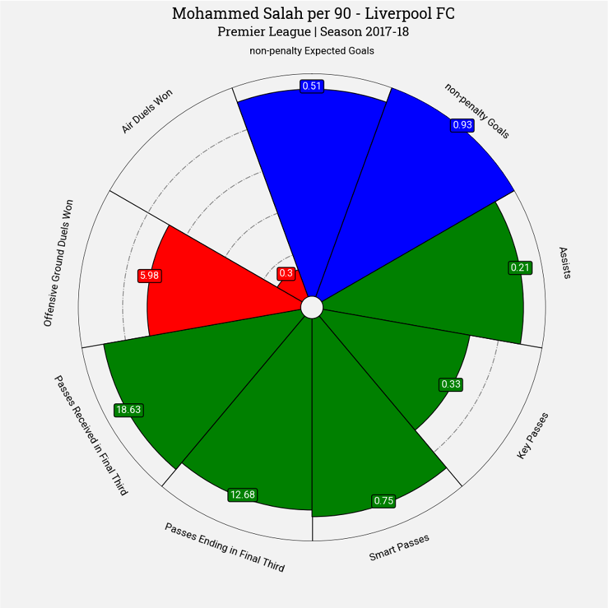
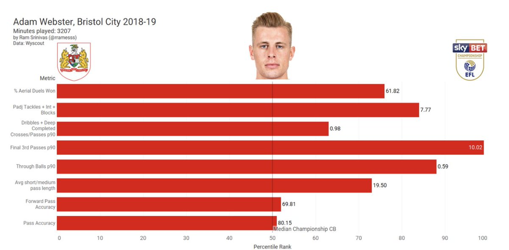
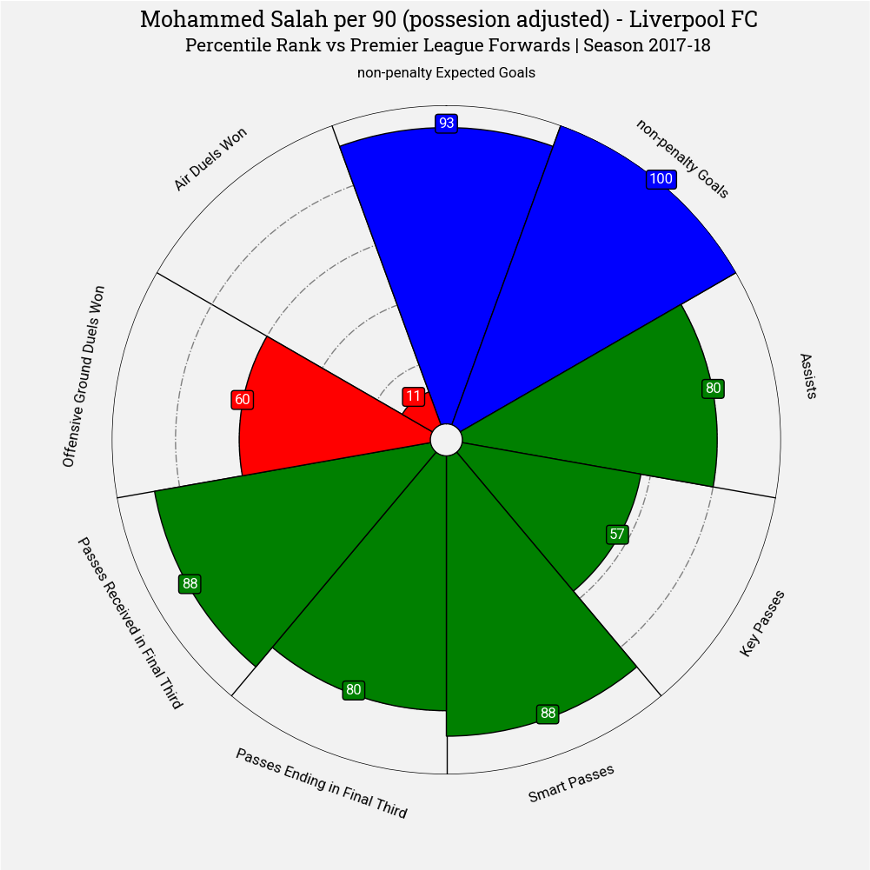
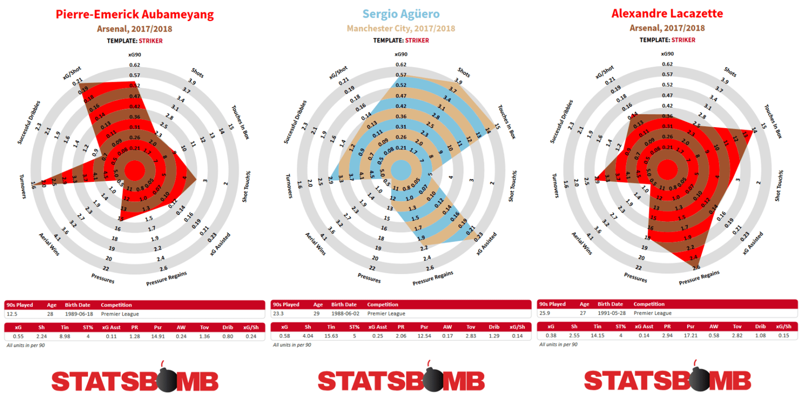
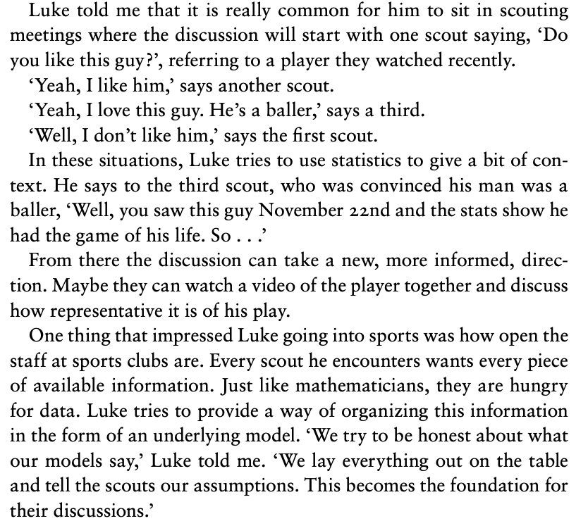

Statistical scouting
====================

VIDEO COMING SEPTEMBER 12th

### Counts of actions

Anyone who has watched football on TV is familiar with player 
statistics such as goals scored, assists, minutes played, distance run and pass completion percentage.
The challenge for us is that, in isolation, these tell us next to nothing about the skills of
a football player. Well...  scoring lots of goals is certainly a sign of a good striker, but it remains 
impossible to measure the qualities of midfielders, left backs etc. using these numbers. 

Even the numbers available on scouting platforms are difficult to put in to context. Here are per match statistics for 
Wyscout's scouting platform. 

There are two major problems with these numbers - which include counts of crosses, duels won, pass percentage etc. 
The first is **context**: we don't know, for example, if the player was completing simple passes between defenders in the backline, or 
more difficult attacking passes. The second is **comparison**: we can't see how this particular player compares to
others in the same league. 

### Context: what to measure

The footballing quote that best illustrates the problem of context in football 
is by Paolo Maldini,

> "If I have to make a tackle then I have already made a mistake"

A good defender should be well positioned in order to prevent the opposition
getting the ball, to discourage a pass being made or ready to intercept a pass 
when it is made. Maldini tells us that the tackle is the last resort of poor defending. So,
if we count tackles, we are measuring poor defending! 

Another example, is pass completion. Percentage completed passes might be 
interpreted as an ability to keep the ball. But it can also measure a possession style
of football where simple passes are carried out. A good example of this was a study 
by [Transfermarkt on highest pass completion rates](https://www.transfermarkt.com/pass-completion-rates-psg-dominate-top-20-otamendi-best-in-premier-league-with-92-4-/view/news/358096).
They found that PSG players Thiago Silver and Presenal Kimpembe had the highest pass completion
rates in the big five European Leagues, with 95.5% and 95.0% respectively. These
two played together as central defenders in a team which dominated the league. All this statistic
shows is that they were rolling to ball backwards and forwards to each other!

In the [example radar](../gallery/lesson3/plot_RadarPlot) for strikers, we
look specifically at passes and receptions in the final third. This adds context
to the passes strikers receive: that they are in dangerous areas. 
It is much more difficult to complete passes close to the opponents goal. 
We also count [smart passes](https://dataglossary.wyscout.com/smart_pass/),
which WyScout categorise as "A creative and 
penetrative pass that attempts to break the opposition's 
defensive lines to gain a significant advantage in attack" and
[key passes](https://dataglossary.wyscout.com/key_pass/) which are 
"immediately creates a clear goal scoring opportunity for a teammate". Both 
of these are somewhat subjective – it is the person collecting the data 
who decides if a pass is smart or key - but they add important context. 
Taken together (with assists) these five statistics give a good overall 
measure of how well a player can pass the ball when attacking.

### Comparison: percentile rankings

The example below (explained in the video) shows how counts are 
converted to percentile rankings. 

We sort the individuals according to their scores and then assign a percentile score
from highest (100%) to lowest (0%). When doing this ranking it is 
important to **compare to players in a similar position in the same league**.
This ranking is shown below for Mohammed Salah in radar form.

Furthest out on the radar is higher in that category. The dotted circular 
lines show the 20-percntile, 40-percentile, ... , 80-percentile. Salah 
scored the most non-penalty goals this season, so is furthest out on 
that measure on the radar. He is top 95 percentile (top 5% of players) 
for non-penalty expected goals.

It can be (very reasonably) argued that radars distort data, because the area of
the radar is not proportional to the percentile. Players in the top percentiles
fill up the radar much more. An alternative is to make bar charts, like in the 
following example created to look for ball-playing centre backs.

This example from an [article on scouting in the Championship](https://medium.com/ram-blings/profiling-ball-playing-centre-backs-in-the-championship-113d4d085420)
illustrates how adding context to some basic stats can really help pin down
the essential qualities of a player.

### Normalisation

Salah plays for Liverpool, who tend to have more possession than their opponents.
This means that he gets more opportunity to make passes and shoot than a
striker playing for a team who have less of the ball. In the [example radar](../gallery/lesson3/plot_RadarPlot),
we calculate minutes played for each player and then we normalise 
by this in order to get shots per minute played where team is in possession.
This reduces Salah's rankings slightly (although not much).

Correcting for possession is not the only way to normalise football data. 
In the video we look at several [Statsbomb radars](https://statsbomb.com/2018/08/new-data-new-statsbomb-radars/
). For example, their striker 
radar is shown below.

Metrics, such as,
<dl>
  <dt><strong>Shot Touch:</strong></dt>
  <dd>The amount of shots a player takes as a proportion of their touches of the ball.</dd>
  <dt><strong>Pressure Regains:</strong></dt>
  <dd>Times a player’s team won the ball back within 5 seconds of the player pressuring an opponent, per 90 minutes.
</dd>
  <dt><strong>Turnovers:</strong></dt>
  <dd>How often a player loses the ball via a 
miscontrol or a failed dribble per 90 minutes.
</dd>
</dl>
are adjusted for not only minutes played and possession, but also the number of touches 
a player takes. In this context, xG/shot (a measure of quality over quantity) is also
important.

You can read more about how to think about normalising football data in one of 
Statsbomb's Ted Knutson's [original posts on the subject](https://statsbomb.com/articles/soccer/introducing-possession-adjusted-player-stats/) and
in a more [recent article](https://theathletic.com/3521723/2022/08/30/touches-football-data-analysis/?source=user_shared_article)
(behind paywall) by Mark Carey.

### Modesty

In this section, we have focussed on context and comparison. Two challenges 
remain: one which we can address with better modelling, the other which we can't.
The one we can address is assigning values to actions. While labels such as smart
passes help us, we still don't have a framework for evaluating other actions in the same
way as we value shots with expected goals. We will start to develop this framework
in the next lesson. 

The challenge which cannot be addressed with data alone is the 
challenge of combining analytics with traditional qualitative scouting.
In the video I give some pointers in this direction. But what I recommend 
most is modesty. Here is an account from my book 
[The Ten Equations that Rule the World](https://www.amazon.com/Ten-Equations-That-Rule-World/dp/1250246962/ref=tmm_hrd_swatch_0?_encoding=UTF8&qid=1647330807&sr=8-1#customerReviews)
of talking to [Luke Bornn](http://www.lukebornn.com) about how he works with scouts

He provides the rest of his organization with statistical summaries, 
charts, newspaper reports, anything and everything they need. 
He tries not to use the word ‘data’ when talking, which tends to be used
in a debate about the reliance on data or on human knowledge; 
instead he sees himself as a provider of information. 
As Luke asked me rhetorically, ‘Who doesn’t want more information?’

‘Maybe, in a way,’ Luke told me, 
‘I don’t need to be the one smart person at the Kings. 
I would much rather be someone who makes everyone else smarter.’

This modesty is, in my experience, a characteristic of 
many of the best applied mathematicians and statisticians.