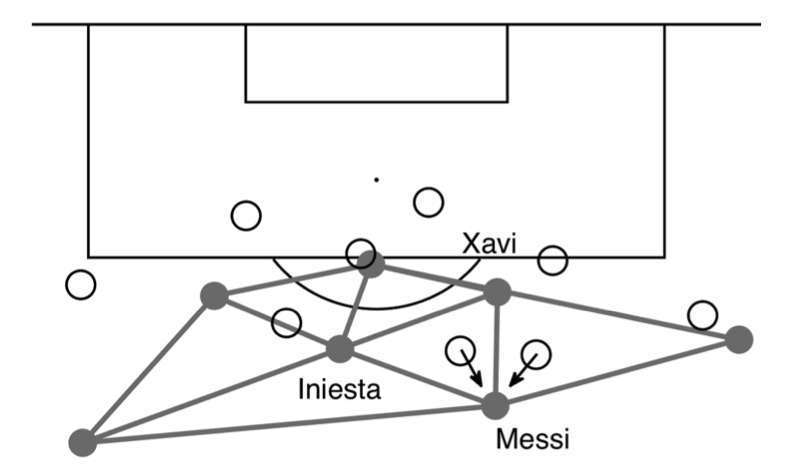

Controlling Space
================

> “What do you do during 87 minutes when you do not have the ball? That is what determines whether 
you’re a good player or not” - Johan Cruyff

Since wingers and forwards can spend as little as 90 seconds on-ball during a game, 
what they do when they have the ball accounts for about 1/40th of a player’s contribution 
during the 60 minutes the ball is typocally in play. The biggest and most exciting 
aspect of football analytics just now is understanding how player movements create space, 
how we can help them improve that movement and (for scouting) measuring how individuals contribute 
to the team when off the ball.

That is what we are going to do in the next two lessons.

VIDEO COMING 3rd OCTOBER

### Voronoi diagrams

Lionel Messi isn't a bad player on the ball. But this quality is not the thing to concentrate on. 
Instead, have a look at (in the 2008-2012 Barcelona in particular) ow his team-mates move around him. 
Typically, he will pass the ball directly to Iniesta or Xavi and then run forward, 
and a second later the ball is back in front of him. In the build-up to their best goals, 
Barcelona make four or five of these direct passes. Now pause the video at exactly the 
point when Messi passes the ball, and look at how his team-mates are positioned.

In the drawing above from a Champions League match between 
Barcelona and Greek champions Panathinaikos in 2010, Messi has the ball and is moving 
towards the goal, and two Panathinaikos players are moving to tackle him. The passing 
triangles show Messi’s options. Xavi is directly in front of Messi, with Iniesta 
to his left. We can already see that their positioning is good because both can receive a direct pass. 

But by drawing a Voronoi diagram, below, we start to see just how good these positions are.

The Voronoi diagram divides up the pitch based on which positions are closest to the players. What is stirking 
here is that 

### Pitch Control 

JAVIER HERE

### Pitch Control in Pressing

Here, David explains an application of pitch control in pressing to get the ball back.

<iframe width="640" height="480" src="https://www.youtube.com/embed/s6bpn3Uox7M" title="YouTube video player" frameborder="0" allow="accelerometer; autoplay; clipboard-write; encrypted-media; gyroscope; picture-in-picture" allowfullscreen></iframe>

