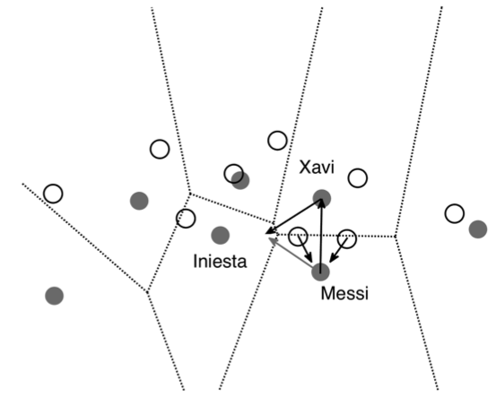

Controlling Space
================

Watch the video first.

<iframe width="640" height="360" src="https://www.youtube.com/embed/F-TSU-UKVA0" title="YouTube video player" frameborder="0" allow="accelerometer; autoplay; clipboard-write; encrypted-media; gyroscope; picture-in-picture" allowfullscreen></iframe>

### Voronoi diagrams

Lionel Messi isn't a bad player on the ball. But this quality is not the thing to concentrate on. 
Instead, have a look at (in the 2008-2012 Barcelona in particular) ow his team-mates move around him. 
Typically, he will pass the ball directly to Iniesta or Xavi and then run forward, 
and a second later the ball is back in front of him. In the build-up to their best goals, 
Barcelona make four or five of these direct passes. Now pause the video at exactly the 
point when Messi passes the ball, and look at how his team-mates are positioned.

In the drawing above from a Champions League match between 
Barcelona and Greek champions Panathinaikos in 2010, Messi has the ball and is moving 
towards the goal, and two Panathinaikos players are moving to tackle him. The passing 
triangles show Messi’s options. Xavi is directly in front of Messi, with Iniesta 
to his left. We can already see that their positioning is good because both can receive a direct pass. 

But by drawing a Voronoi diagram, below, we start to see just how good these positions are.

The Voronoi diagram divides up the pitch based on which positions are closest to the players. What is stirking 
here is that 

### Implementing a pitch control model

Laurie Shaw describes everything you need to create a pitch control model in Python.

<iframe width="640" height="480" src="https://www.youtube.com/embed/5X1cSehLg6s" title="YouTube video player" frameborder="0" allow="accelerometer; autoplay; clipboard-write; encrypted-media; gyroscope; picture-in-picture" allowfullscreen></iframe>

Code for this tutorial can be found [here](https://github.com/Friends-of-Tracking-Data-FoTD/LaurieOnTracking)

Data used in this tutorial can be found [here](https://github.com/metrica-sports/sample-data)

### Pitch Control in Pressing

Here, David explains an application of pitch control in pressing to get the ball back.

<iframe width="640" height="480" src="https://www.youtube.com/embed/s6bpn3Uox7M" title="YouTube video player" frameborder="0" allow="accelerometer; autoplay; clipboard-write; encrypted-media; gyroscope; picture-in-picture" allowfullscreen></iframe>

